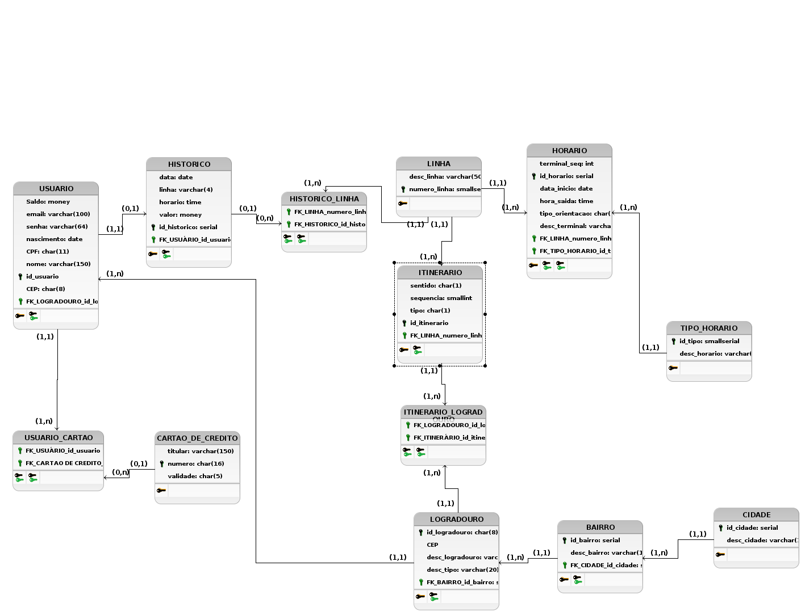

# TRABALHO 01:  Título do Trabalho
Trabalho desenvolvido durante a disciplina de BD1

# Sumário

### 1. COMPONENTES 
Integrantes do grupo:  
Ewerson Vieira Nascimento: ewersonv@gmail.com 
Giuliano de Paulo Demoner: giuliano.demoner@gmail.com 
Lorran Gabriel Araújo: lorrangabriel20@gmail.com 
Marcos Antônio Carneiro de Paula: cardepaula@gmail.com 

### 2.INTRODUÇÃO E MOTIVAÇAO 
#### QR-Bus</b>  
A bilhetagem eletrônica já é uma realidade nos transportes públicos do nosso estado a algum tempo, diversas pessoas fazem uso do seu cartão para se movimentar durante o dia-a-dia, seja de uso particular ou vinculado ao trabalho. Podemos dizer que a solução existente dá conta do recado e atende bem ao seu propósito, mas somente isso. Ainda temos que enfrentar diversos problemas com o uso do cartão como meio de pagamento, como a recarga em que temos que enfrentar uma fila enorme, taxas por perda ou quebra do cartão, complicado monitoramento de saldo e falta de segurança devido as fraudes. 

A partir dessa visão começamos a buscar por alternativas que poderiam atuar como meio de pagamento das passagens, sendo acessível, seguro e fácil de utilizar. A resposta estava bem na nossa frente, nossos smartphones. 

Através de tecnologias presentes nesses dispositivos seria possível efetuar o pagamento da mesma forma que já conhecemos, apenas o aproximando do leitor, ou até mesmo com um qrcode gerado e lido por câmeras já presentes nos coletivos, mas que tem como finalidade a identificação de fraudes por comparação facial. Além das funções de pagamento de um cartão comum, esse novo método traria os benefícios da internet, facilitando a recarga de nossas passagens através de cartões de credito ou boletos bancários. Como essas funções teriam que ser controlados por meio de um software, ainda poderíamos ter um controle de nossos gastos, com históricos de transações, linhas utilizadas e muito mais. 
 

### 3.MINI-MUNDO 

O sistema proposto conterá as informacões aqui detalhadas. Dos usuários serão armazenados o nome completo, data de nascimento, cpf, endereço, e-mail e senha, sendo esse dois ultimos para efetuar login no sistema. O saldo será informado de acordo com o valor obtido nas operações de recarga e pagamento de passagens, sendo atualizado a cada nova operação realizada. Só poderá existir um único cadastro para cada CPF. Dos meios de pagamento, serão armazenados dados de cartões de credito salvos, contendo o número do cartão, nome do titular e data de validade. Os dados armazenados pertinentes ao cartão de credito deverão seguir as regras do PCI Security Standards Council visando a confiabilidade do sistema. Um usuário pode ter mais de um cartão de crédito. O histórico de uso do aplicativo também deve ter seus dados armazenados, que são as linhas usadas, junto com a data, horário e valor debitado da conta. Os dados dos horários de onibus serão obitidos por API, que devem possuir número da linha, descrição e os horários semanais e diários de origem e destino. O itinerário também será obtido por API, com linha, sentido da linha, ponto de origem, pontos de passagem e ponto de destino da linha. O saldo do usuário deve ser sincronizado com a empresa responsável pelo seu uso (companhia de transporte). 

### 4.RASCUNHOS BÁSICOS DA INTERFACE (MOCKUPS) 

#### 4.1 QUAIS PERGUNTAS PODEM SER RESPONDIDAS COM O SISTEMA PROPOSTO?
   <b>A Empresa QR-Bus precisa inicialmente dos seguintes relatórios:</b>
* Relatório que informe ao usuário seu histórico de viagens, com dias e horários em que usou o sistema, assim como as linhas utilizadas.
* Relatório que informe as linhas mais utilizadas e as menos utilizadas dependendo do horário.
* Relatório direcionado ao usuário informando as melhores opções de linhas para sair de sua origem à seu destino.
* Relatório que informe à gerência bairros ou pontos de ônibus onde há maior concentração de passageiros que efetuam o embarque e o desembarque dos coletivos.
* Relatório de tempo médio de viagem de cada linha do ponto de partida ao ponto de chegada (definidos pelo usuário).
* Relatório direcionado ao usuário para controle de seu saldo, com quantidade de viagens feitas por dia/semana/mês, valor de cada viagem e gasto total no período definido.
 
#### 4.2 TABELA DE DADOS DO SISTEMA:

    
>## Marco de Entrega 01 em: (06/09/2018) 

### 5.MODELO CONCEITUAL 
 

     
        
    
#### 5.1 Validação do Modelo Conceitual
   <b>[Grupo01]:</b> Psicultura Inteligente (André Altivo, Gabriela Piffer, Lucca Machado e Marcelo Mendes)
    <b>[Grupo02]:</b> Grupo do Wallace (não informou nome do trabalho nem dos integrantes do grupo)

#### 5.2 DECISÕES DE PROJETO
   <b>Tipo_Horario:</b> Essa tabela foi criada com o intuito de identificar qual o tipo de horario será seguido por aquela linha, dias úteis, feriados, atípicos entre feriados ou fins de semana. 
   
   <b>Cartão:</b> A tabela cartão possui relação (0,n) com usuário, pois decidimos que o usuário pode ou não ter um cartão de crédito para usar o app. 
   
>## Marco de Entrega 02 em: (17/09/2018) 
#### 5.3 DESCRIÇÃO DOS DADOS 
   <b>USUARIO:</b> Tabela que armazena informações relacionadas ao usuário do sistema. 
   <b>CARTAO DE CREDITO:</b> Tabela que contém dados do cartão de passagem do usuário. 
   <b>HISTORICO:</b> Tabela que armazena o histórico de pagamentos em datas e horarios específicos. 
   <b>LINHA:</b> Contém informações sobre a linha do ônibus. 
   <b>HORÁRIO:</b> Contém dados sobre horarios das linhas. 
   <b>TIPO_HORARIO:</b> Tabela que armazena os tipos de horário (dias úteis, feriados, atípicos entre feriados ou fins de semana). 
   <b>ITINERARIO:</b> Armazena informações sobre o sentido da linha (ida ou volta) e a sequência de logradouros que ela percorrerá. 
   <b>LOGRADOURO:</b> Armazena informações sobre o logradouro (CEP, tipo e nome). 
   <b>BAIRRO:</b> Armazena informações sobre o bairro (nome e ID). 
   <b>CIDADE:</b> Armazena informações sobre a cidade (nome e ID). 

### 6	MODELO LÓGICO 
    

### 7	MODELO FÍSICO 
            
        
### 8	INSERT APLICADO NAS TABELAS DO BANCO DE DADOS 
#### 8.1 DETALHAMENTO DAS INFORMAÇÕES
        a) inclusão das instruções de inserção dos dados nas tabelas criadas pelo script de modelo físico 
        b) formato .SQL

#### 8.2 INCLUSÃO DO SCRIPT PARA CRIAÇÃO DE TABELAS E INSERÇÃO DOS DADOS
        a) Junção dos scripts anteriores em um único script 
        (create para tabelas e estruturas de dados + dados a serem inseridos)
        b) Criar um novo banco de dados para testar a restauracao 
        (em caso de falha na restauração o grupo não pontuará neste quesito)
        c) formato .SQL
#### 8.3 INCLUSÃO DO SCRIPT PARA EXCLUSÃO DE TABELAS EXISTENTES, CRIAÇÃO DE TABELA NOVAS E INSERÇÃO DOS DADOS
        a) Junção dos scripts anteriores em um único script
        (Drop para exclusão de tabelas + create para tabelas e estruturas de dados + dados a serem inseridos)
        b) Criar um novo banco de dados para testar a restauracao 
        (em caso de falha na restauração o grupo não pontuará neste quesito)
        c) formato .SQL
>## Marco de Entrega 03 em: (27/09/18)  

### 9	TABELAS E PRINCIPAIS CONSULTAS 
    OBS: Incluir para cada tópico as instruções SQL + imagens (print da tela) mostrando os resultados. 
#### 9.1	CONSULTAS DAS TABELAS COM TODOS OS DADOS INSERIDOS (Todas)  
#### 9.2	CONSULTAS DAS TABELAS COM FILTROS WHERE (Mínimo 4) 
#### 9.3	CONSULTAS QUE USAM OPERADORES LÓGICOS, ARITMÉTICOS E TABELAS OU CAMPOS RENOMEADOS (Mínimo 11)
    a) Criar 5 consultas que envolvam os operadores lógicos AND, OR e Not
    b) Criar no mínimo 3 consultas com operadores aritméticos 
    c) Criar no mínimo 3 consultas com operação de renomear nomes de campos ou tabelas
#### 9.4	CONSULTAS QUE USAM OPERADORES LIKE E DATAS (Mínimo 12)  
    a) Criar outras 5 consultas que envolvam like ou ilike
    b) Criar uma consulta para cada tipo de função data apresentada.

#### 9.5	ATUALIZAÇÃO E EXCLUSÃO DE DADOS (Mínimo 6) 

>## Marco de Entrega 04 em: (18/10/2017) 

#### 9.6	CONSULTAS COM JUNÇÃO E ORDENAÇÃO (Mínimo 6) 
        a) Uma junção que envolva todas as tabelas possuindo no mínimo 3 registros no resultado
        b) Outras junções que o grupo considere como sendo as de principal importância para o trabalho
#### 9.7	CONSULTAS COM GROUP BY E FUNÇÕES DE AGRUPAMENTO (Mínimo 6) 
#### 9.8	CONSULTAS COM LEFT E RIGHT JOIN (Mínimo 4) 
#### 9.9	CONSULTAS COM SELF JOIN E VIEW (Mínimo 6) 
        a) Uma junção que envolva Self Join
        b) Outras junções com views que o grupo considere como sendo de relevante importância para o trabalho
#### 9.10	SUBCONSULTAS (Mínimo 3) 
### 10	ATUALIZAÇÃO DA DOCUMENTAÇÃO DOS SLIDES PARA APRESENTAÇAO FINAL (Mínimo 6 e Máximo 10) 

### 11 Backup completo do banco de dados postgres 
    a) deve ser realizado no formato "backup" 
        (Em Dump Options #1 Habilitar opções Don't Save Owner e Privilege)
    b) antes de postar o arquivo no git o mesmo deve ser testado/restaurado por outro grupo de alunos/dupla
    c) informar aqui o grupo de alunos/dupla que realizou o teste.

### 12	TUTORIAL COMPLETO DE PASSOS PARA RESTAURACAO DO BANCO E EXECUCAO DE PROCEDIMENTOS ENVOLVIDOS NO TRABALHO PARA OBTENÇÃO DOS RESULTADOS 
        a) Outros grupos deverão ser capazes de restaurar o banco 
        b) executar todas as consultas presentes no trabalho
        c) executar códigos que tenham sido construídos para o trabalho 
        d) realizar qualquer procedimento executado pelo grupo que desenvolveu o trabalho
        
### 13   DIFICULDADES ENCONTRADAS PELO GRUPO 
>## Marco de Entrega Final em: (08/11/2018) 
        
### 14  FORMATACAO NO GIT: https://help.github.com/articles/basic-writing-and-formatting-syntax/
<comentario no git>
    
##### About Formatting
    https://help.github.com/articles/about-writing-and-formatting-on-github/
    
##### Basic Formatting in Git
    
    https://help.github.com/articles/basic-writing-and-formatting-syntax/#referencing-issues-and-pull-requests
    
    
##### Working with advanced formatting
    https://help.github.com/articles/working-with-advanced-formatting/
#### Mastering Markdown
    https://guides.github.com/features/mastering-markdown/

    

    
### OBSERVAÇÕES IMPORTANTES

#### Todos os arquivos que fazem parte do projeto (Imagens, pdfs, arquivos fonte, etc..), devem estar presentes no GIT. Os arquivos do projeto vigente não devem ser armazenados em quaisquer outras plataformas.
1. Caso existam arquivos com conteúdos sigilosos, comunicar o professor que definirá em conjunto com o grupo a melhor forma de armazenamento do arquivo.

#### Todos os grupos deverão fazer Fork deste repositório e dar permissões administrativas ao usuário do git "profmoisesomena", para acompanhamento do trabalho.

#### Os usuários criados no GIT devem possuir o nome de identificação do aluno (não serão aceitos nomes como Eu123, meuprojeto, pro456, etc). Em caso de dúvida comunicar o professor.

Link para BrModelo: 
http://www.sis4.com/brModelo/download.html
 

Link para curso de GIT 

