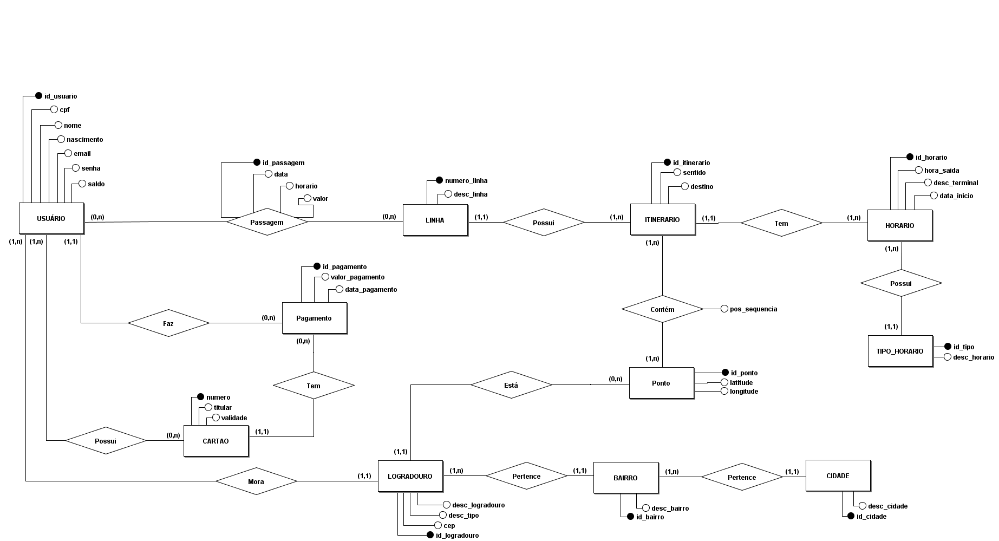
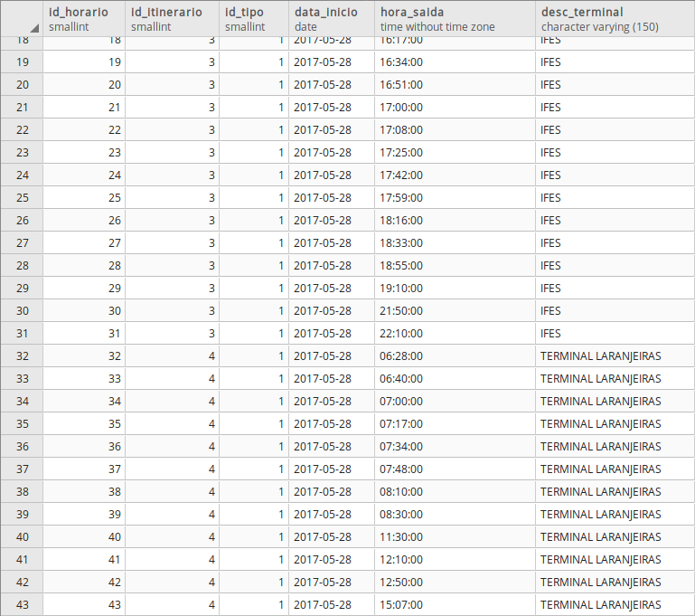

# TRABALHO 01:  QR-Bus
Trabalho desenvolvido durante a disciplina de BD1

# Sumário

### 1. COMPONENTES 
Integrantes do grupo:  
Ewerson Vieira Nascimento: ewersonv@gmail.com 
Giuliano de Paulo Demoner: giuliano.demoner@gmail.com 
Lorran Gabriel Araújo: lorrangabriel20@gmail.com 
Marcos Antônio Carneiro de Paula: cardepaula@gmail.com 

### 2.INTRODUÇÃO E MOTIVAÇAO 
A bilhetagem eletrônica já é uma realidade nos transportes públicos do nosso estado a algum tempo, diversas pessoas fazem uso do seu cartão para se movimentar durante o dia-a-dia, seja de uso particular ou vinculado ao trabalho. Podemos dizer que a solução existente dá conta do recado e atende bem ao seu propósito, mas somente isso. Ainda temos que enfrentar diversos problemas com o uso do cartão como meio de pagamento, como a recarga em que temos que enfrentar uma fila enorme, taxas por perda ou quebra do cartão, complicado monitoramento de saldo e falta de segurança devido as fraudes. 

A partir dessa visão começamos a buscar por alternativas que poderiam atuar como meio de pagamento das passagens, sendo acessível, seguro e fácil de utilizar. A resposta estava bem na nossa frente, nossos smartphones. 

Através de tecnologias presentes nesses dispositivos seria possível efetuar o pagamento da mesma forma que já conhecemos, apenas o aproximando do leitor, ou até mesmo com um qrcode gerado e lido por câmeras já presentes nos coletivos, mas que tem como finalidade a identificação de fraudes por comparação facial. Além das funções de pagamento de um cartão comum, esse novo método traria os benefícios da internet, facilitando a recarga de nossas passagens através de cartões de credito ou boletos bancários. Como essas funções teriam que ser controlados por meio de um software, ainda poderíamos ter um controle de nossos gastos, com históricos de transações, linhas utilizadas e muito mais. 
 

### 3.MINI-MUNDO 

O sistema proposto conterá as informacões aqui detalhadas. Dos usuários serão armazenados o nome completo, data de nascimento, cpf, endereço, e-mail e senha, sendo esse dois ultimos para efetuar login no sistema. O saldo será informado de acordo com o valor referente ao saldo do usuário no próprio sistema da GVBus, sendo atualizado em tempo real a cada nova operação de recarga ou pagamento realizada. Só poderá existir um único cadastro para cada CPF. Dos meios de pagamento, serão armazenados dados de cartões de credito salvos, contendo o número do cartão, nome do titular e data de validade. Os dados armazenados pertinentes ao cartão de credito deverão seguir as regras do PCI Security Standards Council visando a confiabilidade do sistema. Um usuário pode ter mais de um cartão de crédito. O histórico de uso do aplicativo também deve ter seus dados armazenados, que são as linhas usadas, junto com a data, horário e valor debitado da conta. Os dados dos horários de onibus serão obitidos por API, que devem possuir número da linha, descrição e os horários semanais e diários de origem e destino. O itinerário também será obtido por API, com linha, sentido da linha, ponto de origem, pontos de passagem e ponto de destino da linha. O saldo do usuário deve ser sincronizado com a empresa responsável pelo seu uso (companhia de transporte). 

### 4.RASCUNHOS BÁSICOS DA INTERFACE (MOCKUPS) 
[Mockup feito com Balsamiq](/arquivos/Mockup.pdf)
#### 4.1 QUAIS PERGUNTAS PODEM SER RESPONDIDAS COM O SISTEMA PROPOSTO?
   <b>A Empresa QR-Bus precisa inicialmente dos seguintes relatórios:</b>
* Relatório que informe ao usuário seu histórico de viagens, com dias e horários em que usou o sistema, assim como as linhas utilizadas.
* Relatório que informe as linhas mais utilizadas e as menos utilizadas (por todos os usuários) dependendo do horário.
* Lista direcionada ao usuário informando as melhores opções de linhas para sair de sua origem à seu destino.
* Relatório que informe à gerência bairros ou pontos de ônibus onde há maior concentração de passageiros que efetuam o embarque e o desembarque dos coletivos.
* Relatório de tempo médio de viagem de cada linha do ponto de partida ao ponto de chegada (definidos pelo usuário).
* Relatório direcionado ao usuário para controle de seu saldo, com quantidade de viagens feitas por dia/semana/mês, valor de cada viagem e gasto total no período definido.
 
#### 4.2 TABELA DE DADOS DO SISTEMA:
[Tabela de dados QR-Bus](https://github.com/qr-bus/trab01/tree/master/arquivos/Tabelao_qr-bus.xlsx?raw=true "Tabela - Empresa QR-Bus")
    
>## Marco de Entrega 01 em: (06/09/2018) 

### 5.MODELO CONCEITUAL 
 

     
        
    
#### 5.1 Validação do Modelo Conceitual
   <b>[Grupo01]:</b> Psicultura Inteligente (André Altivo, Gabriela Piffer, Lucca Machado e Marcelo Mendes)
    <b>[Grupo02]:</b> Carga Pesada (Leonardo Sena, Matheus Aguiar, Wallace de Paula e Willian Vaneli)

#### 5.2 DECISÕES DE PROJETO
   <b>Tipo_Horario:</b> Essa tabela foi criada com o intuito de identificar qual o tipo de horario será seguido por aquela linha, dias úteis, feriados, atípicos entre feriados ou fins de semana. 
   
   <b>Cartão:</b> A tabela cartão possui relação (0,n) com usuário, pois decidimos que o usuário pode ou não ter um cartão de crédito para usar o app. 
   
>## Marco de Entrega 02 em: (17/09/2018) 
#### 5.3 DESCRIÇÃO DOS DADOS 
   <b>USUARIO:</b> Tabela que armazena informações relacionadas ao usuário do sistema. 
   		id_usuario: id do usuário, gerado automaticamente. 
		cpf: cpf do usuário. 
		nome: nome completo do usuário. 
		nascimento: data de nascimento do usuário. 
		email: email do usuário. 
		senha: senha do usuário. 
		saldo: saldo do usuário para pagamento de passagens. 
   <b>CARTAO:</b> Tabela que contém dados do cartão de passagem do usuário. 
   		numero: número do cartão do usuário. 
		titular: nome do titular do cartão. 
		validade: data de validade presente no cartão. 
   <b>PASSAGEM:</b> Tabela que armazena os pagamentos de passagens em datas e horarios específicos. 
   		id_passagem: id da passagem, gerado automaticamente. 
		numero_linha: linha utilizada pelo usuário. 
		data: data em que o usuário pagou a passagem. 
		horario: horário em que a passagem foi paga. 
		valor: valor da passagem paga. 
   <b>LINHA:</b> Contém informações sobre a linha do ônibus. 
   		numero_linha: número da linha. 
		desc_linha: descrição (nome) da linha. 
   <b>HORÁRIO:</b> Contém dados sobre horarios das linhas. 
   		id_horario: id da linha, gerado automaticamente. 
		hora_saida: horário em que o ônibus sai do terminal. 
		desc_terminal: nome do terminal que o ônibus sairá. 
		data_inicio: data em que este horário começou a ser utilizado. 
   <b>TIPO_HORARIO:</b> Tabela que armazena os tipos de horário. 
   		id_tipo: id do tipo de horário, gerado automaticamente. 
		desc_horario: descrição do tipo (dias úteis, feriados, atípicos entre feriados ou fins de semana). 
   <b>ITINERARIO:</b> Armazena informações sobre o sentido da linha (ida ou volta). 
   		id_itinerario: id do itinerário atrelado a cada rua que a linha percorrerá, gerado automaticamente. 
		sentido: informa o sentido que a linha percorrerá (ida ou volta). 
		sequencia: cada rua pela qual o ônibus passará. 
   <b>ITINERARIO_PONTO</b> Faz o intermédio entre a entidade Intenario e a Ponto. 
		id_intin_ponto: id do itinerario_ponto. 
		pos_sequencia: posiçao na sequencia de pontos que o itinerário possui. 
   <b>PONTO:</b> Armazena as coordenas do ponto. 
   		id_ponto: id do ponto, gerado automaticamente. 
		latitude: latitude para posição geográfica do ponto. 
		longitude: longitude para posição geográfica do ponto. 
   <b>LOGRADOURO:</b> Armazena informações sobre o logradouro (CEP, tipo e nome). 
   		id_logradouro: id do logradouro, gerado automaticamente. 
		cep: número CEP. 
		desc_tipo: descrição do tipo de logradouro (rua, avenida, travessa...). 
		desc_logradouro: nome do logradouro. 
   <b>BAIRRO:</b> Armazena informações sobre o bairro (nome e ID). 
   		id_bairro: id do bairro, gerado automaticamente. 
		desc_bairro: nome do bairro. 
   <b>CIDADE:</b> Armazena informações sobre a cidade (nome e ID). 
   		id_cidade: id da cidade, gerado automaticamente. 
		desc_cidade: nome da cidade. 

### 6	MODELO LÓGICO 
    

### 7	MODELO FÍSICO 
   [Modelo Fisico](arquivos/QR-Bus_-_modelo_fisico.sql)         
        
### 8	INSERT APLICADO NAS TABELAS DO BANCO DE DADOS 
#### 8.1 DETALHAMENTO DAS INFORMAÇÕES 
   [Inserção dos dados](sql/insert.sql)

#### 8.2 INCLUSÃO DO SCRIPT PARA CRIAÇÃO DE TABELAS E INSERÇÃO DOS DADOS
   [Create + Inserts](sql/create_e_insert.sql)
   
#### 8.3 INCLUSÃO DO SCRIPT PARA EXCLUSÃO DE TABELAS EXISTENTES, CRIAÇÃO DE TABELA NOVAS E INSERÇÃO DOS DADOS
   [Drop + Create + Inserts](sql/drop_create_insert.sql)
>## Marco de Entrega 03 em: (27/09/18)  

### 9	TABELAS E PRINCIPAIS CONSULTAS 
    OBS: Incluir para cada tópico as instruções SQL + imagens (print da tela) mostrando os resultados. 
#### 9.1	CONSULTAS DAS TABELAS COM TODOS OS DADOS INSERIDOS (Todas)  

<b>SELECT * FROM BAIRRO;

<b>SELECT * FROM CARTAO;

<b>SELECT * FROM CIDADE;

<b>SELECT * FROM HORARIO;

<b>SELECT * FROM ITINERARIO;

<b>SELECT * FROM ITINERARIO_PONTO;

<b>SELECT * FROM LINHA;

<b>SELECT * FROM LOGRADOURO;

<b>SELECT * FROM PAGAMENTO;

<b>SELECT * FROM PASSAGEM;

<b>SELECT * FROM PONTO;

<b>SELECT * FROM TIPO_HORARIO;

<b>SELECT * FROM USUARIO;

#### 9.2	CONSULTAS DAS TABELAS COM FILTROS WHERE (Mínimo 4) 

   <b>SELECT * FROM logradouro WHERE desc_tipo = 'Avenida';</b>
   
   
   <b>SELECT * FROM itinerario WHERE destino = 'T.JACARAIPE';</b>
   
   
   <b>SELECT * FROM horario WHERE hora_saida > '07:00:00' AND hora_saida < '07:50:00';</b>
   
   
   <b>SELECT * FROM logradouro WHERE desc_tipo = 'Rua';</b>
   

#### 9.3	CONSULTAS QUE USAM OPERADORES LÓGICOS, ARITMÉTICOS E TABELAS OU CAMPOS RENOMEADOS (Mínimo 11)
    a) Criar 5 consultas que envolvam os operadores lógicos AND, OR e Not
    
   <b>SELECT * FROM logradouro WHERE desc_logradouro = 'Rio Branco' OR id_bairro = '2';</b>
   
   
   
   <b>SELECT hora_saida, numero_linha FROM horario WHERE (hora_saida > '09:09:00' AND numero_linha = 507);</b>
   
   
   
   <b>SELECT hora_saida, numero_linha FROM horario WHERE ((hora_saida > '09:09:00') </b> 
     <b>AND (numero_linha = 507 OR  numero_linha = 815));</b> 
   
   
   <b>SELECT (desc_tipo|| '. '||desc_logradouro) FROM logradouro WHERE ((id_bairro = 4) OR (id_bairro = 7));</b>
   
   
   
   <b>SELECT hora_saida, numero_linha FROM horario WHERE ((hora_saida > '09:09:00') AND (NOT numero_linha = 815));</b> 
     
   
   
   
    b) Criar no mínimo 3 consultas com operadores aritméticos 
    
   <b>SELECT numero_cartao,valor_pagamento,(valor_pagamento - 3.40) AS sobra 
   FROM PAGAMENTO WHERE (id_pagamento > 5 );</b> 
     
   
   <b>SELECT cartao.titular ,valor_pagamento,(valor_pagamento + 90.00) AS sobra FROM PAGAMENTO</b> 
   <b>INNER JOIN cartao ON (cartao.numero = '1111222233339999' OR cartao.numero = '1111222233338888')</b> 
   <b>GROUP BY titular,valor_pagamento;</b> 
   
     
   
   <b>SELECT cartao.titular ,valor_pagamento,CAST((valor_pagamento / 3.40) AS DECIMAL(3,0)) AS numero_passagens</b> 
   <b>FROM PAGAMENTO INNER JOIN cartao ON (cartao.numero = '1111222233333333' OR cartao.numero = '1111222233338888' OR </b> 
   <b>cartao.numero = '1111222233335555') GROUP BY titular,valor_pagamento;</b> 
   
     
   c) Criar no mínimo 3 consultas com operação de renomear nomes de campos ou tabelas
   
   <b> 1 </b> 
   <b> ALTER TABLE CIDADE RENAME TO MUNICIPIO; </b> 
   <b> SELECT * FROM MUNICIPIO; </b> 
    
   
   <b> 2 </b> 
   <b> Antes </b> 
   <b>SELECT * FROM linha;</b> 
    
   <b> DEPOIS </b> 
   <b> ALTER TABLE LINHA RENAME COLUMN desc_linha TO descricao_linha;</b> 
    
   
   <b> 3 </b> 
   <b> Antes </b> 
   <b>SELECT * FROM MUNICIPIO;</b> 
    
   <b> DEPOIS </b> 
   <b> ALTER TABLE MUNICIPIO RENAME COLUMN desc_cidade TO nome_municipio;</b> 
   <b> ALTER TABLE MUNICIPIO RENAME COLUMN id_cidade TO id_municipio;</b> 
    
      
#### 9.4	CONSULTAS QUE USAM OPERADORES LIKE E DATAS (Mínimo 12)  
    a) Criar outras 5 consultas que envolvam like ou ilike
   <b>SELECT numero_linha FROM LINHA WHERE descricao_linha LIKE 'T.LARANJEIRAS%' OR descricao_linha LIKE '%T.ITAPARICA VIA T.CARAPINA%';</b> 
    
   
   <b> SELECT titular,validade FROM cartao WHERE((numero = '1111222233332222' ) OR (validade LIKE '%2022'));</b> 
    
   
   <b> SELECT titular,validade FROM cartao WHERE((numero = '1111222233338888' ) OR (titular LIKE '%Fernandes') OR (titular LIKE 'A%'));</b> 
    
   
   <b> SELECT desc_bairro FROM bairro WHERE ((id_cidade = 2) AND ( desc_bairro ILIKE 'jardim%'));</b> 
    
   
   <b> SELECT nome, nascimento FROM usuario WHERE nome ILIKE 'J%' OR nome ILIKE 'A%' order by nascimento desc;</b> 
     
    
    b) Criar uma consulta para cada tipo de função data apresentada.

   <b>SELECT numero_linha, age(current_date, horario.data_inicio) as "Tempo sem modificar o horario" 
   FROM HORARIO 
   GROUP BY numero_linha, age(current_date, horario.data_inicio);</b> 

     

   <b>SELECT numero_linha, 
   current_time(0) AS "hora atual", 
   hora_saida AS "próximos horarios" 
   FROM HORARIO 
   WHERE numero_linha = 815  
   AND hora_saida > current_time(0);</b> 

     

   <b>SELECT nome,  
   nascimento, 
   date_part('year', age(now(), nascimento)) AS idade 
   FROM usuario;</b> 

     

   <b>SELECT usuario.nome,  
   extract('month' FROM pagamento.data_pagamento) AS "Meses de compra passagem" 
   FROM PAGAMENTO 
   INNER JOIN CARTAO 
   ON (cartao.numero = pagamento.numero_cartao) 
   INNER JOIN USUARIO 
   ON (usuario.numero_cartao = cartao.numero);</b> 

     

#### 9.5	ATUALIZAÇÃO E EXCLUSÃO DE DADOS (Mínimo 6) 
   
   <b> 1 </b> 
   <b> Antes </b> 
   <b>SELECT * FROM passagem;</b> 
    
   <b> DEPOIS </b> 
   <b> UPDATE passagem SET valor = 1.70 WHERE hora = '07:30:00';</b> 
    
   
   <b> 2 </b> 
   <b> Antes </b> 
   <b>SELECT * FROM cartao;</b> 
    
   <b> DEPOIS </b> 
   <b> UPDATE cartao SET titular = 'Joao da Silva Junior' WHERE titular = 'Joao da Silva';</b> 
    

   <b> 3 </b> 
   <b> Antes </b> 
   <b>SELECT * FROM pagamento;</b> 
    
   <b> DEPOIS </b> 
   <b> UPDATE pagamento SET valor_pagamento = 150.00 WHERE data_pagamento = '2018-02-08' OR data_pagamento = '2018-06-08';</b> 
    
   
   <b> 4 </b> 
   <b> Antes </b> 
   <b>SELECT * FROM passagem;</b> 
    
   <b> DEPOIS </b> 
   <b> DELETE FROM passagem WHERE data = '2018-10-09';</b> 
    
   
   <b> 5 </b> 
   <b> Antes </b> 
   <b>SELECT * FROM pagamento;</b> 
    
   <b> DEPOIS </b> 
   <b> DELETE FROM pagamento WHERE id_pagamento = 7;</b> 
    
   
   <b> 6 </b> 
   <b> Antes </b> 
   <b>SELECT * FROM itinerario;</b> 
    
   <b> DEPOIS </b> 
   <b> DELETE FROM itinerario WHERE numero_linha = 611;</b> 
    

>## Marco de Entrega 04 em: (18/10/2017) 

#### 9.6	CONSULTAS COM JUNÇÃO E ORDENAÇÃO (Mínimo 6) 
        a) Uma junção que envolva todas as tabelas possuindo no mínimo 3 registros no resultado

   <b>INSERT PARA O PRÓXIMO JOIN</b> 

   <b>INSERT INTO PASSAGEM (id_passagem, id_usuario, numero_linha, id_pagamento, data, hora, valor) 
    VALUES (11,3,507,10,'2018-10-15','12:30:00', 3.40), 
    (12,3,507,10,'2018-10-15','18:00:00', 3.40), 
    (13,3,507,10,'2018-10-16','12:30:00', 3.40), 
    (14,3,507,10,'2018-10-16','18:00:00', 3.40), 
    (15,3,507,10,'2018-10-17','12:30:00', 3.40), 
    (16,3,507,10,'2018-10-17','18:00:00', 3.40), 
    (17,3,507,10,'2018-10-18','12:30:00', 3.40), 
    (18,3,507,10,'2018-10-18','18:00:00', 3.40), 
    (19,3,507,10,'2018-10-19','12:30:00', 3.40), 
    (20,3,507,10,'2018-10-19','18:00:00', 3.40); 

   INSERT INTO HORARIO (id_horario, hora_saida, id_tipo , data_inicio, numero_linha, desc_terminal) 
    VALUES (67,'10:30:00',1,'2017-10-15',507,'TERMINAL LARANJEIRAS'), 
    (68,'10:50:00',1,'2017-10-15',507,'TERMINAL LARANJEIRAS'), 
    (69,'11:10:00',1,'2017-10-15',507,'TERMINAL LARANJEIRAS'), 
    (70,'11:25:00',1,'2017-10-15',507,'TERMINAL LARANJEIRAS'), 
    (71,'11:40:00',1,'2017-10-15',507,'TERMINAL LARANJEIRAS'), 
    (72,'11:55:00',1,'2017-10-15',507,'TERMINAL LARANJEIRAS'), 
    (73,'12:10:00',1,'2017-10-15',507,'TERMINAL LARANJEIRAS'), 
    (74,'12:25:00',1,'2017-10-15',507,'TERMINAL LARANJEIRAS'), 
    (75,'12:40:00',1,'2017-10-15',507,'TERMINAL LARANJEIRAS'), 
    (76,'12:55:00',1,'2017-10-15',507,'TERMINAL LARANJEIRAS'), 
    (77,'13:10:00',1,'2017-10-15',507,'TERMINAL LARANJEIRAS'), 
    (78,'13:25:00',1,'2017-10-15',507,'TERMINAL LARANJEIRAS'), 
    (79,'13:45:00',1,'2017-10-15',507,'TERMINAL LARANJEIRAS');</b> 

   <b>JOIN COM TODAS AS TABELAS</b> 

   <b>SELECT usuario.nome, 
   cartao.numero AS "Cartao de credito", 
   pagamento.data_pagamento AS "Data recarga",  
   passagem.data AS "Data da passagem", 
   passagem.hora AS "Horario da passagem", 
   linha.descricao_linha AS "Linha", 
   horario.hora_saida, 
   tipo_horario.desc_horario AS "Tipo de horario", 
   itinerario.destino AS "Destino do onibus", 
   itinerario_ponto.pos_sequencia, 
   ponto.id_ponto, 
   logradouro.desc_tipo AS "Itinerario - Tipo logradouro", 
   logradouro.desc_logradouro AS "Itinerario - Nome logradouro", 
   bairro.desc_bairro AS "Itinerario - Bairro",  
   municipio.nome_municipio AS "Itinerario - Cidade" 
   FROM USUARIO 
   INNER JOIN CARTAO 
   ON (usuario.numero_cartao = cartao.numero) 
   INNER JOIN PAGAMENTO  
   ON (cartao.numero = pagamento.numero_cartao) 
   INNER JOIN PASSAGEM 
   ON (passagem.id_usuario = usuario.id_usuario) 
   INNER JOIN LINHA  
   ON (passagem.numero_linha = linha.numero_linha) 
   INNER JOIN HORARIO 
   ON (linha.numero_linha = horario.numero_linha) 
   INNER JOIN TIPO_HORARIO 
   ON (horario.id_tipo = tipo_horario.id_tipo) 
   INNER JOIN ITINERARIO 
   ON (itinerario.numero_linha = linha.numero_linha) 
   INNER JOIN ITINERARIO_PONTO  
   ON (itinerario.id_itinerario = itinerario_ponto.id_itinerario) 
   INNER JOIN PONTO 
   ON (ponto.id_ponto = itinerario_ponto.id_ponto) 
   INNER JOIN LOGRADOURO 
   ON (ponto.id_logradouro = logradouro.id_logradouro) 
   INNER JOIN BAIRRO 
   ON (logradouro.id_bairro = bairro.id_bairro) 
   INNER JOIN MUNICIPIO 
   ON (bairro.id_cidade = municipio.id_municipio) 
   WHERE passagem.hora = '12:30:00' 
   AND horario.hora_saida = '12:25:00' 
   AND ponto.id_ponto = 1</b> 
    

        b) Outras junções que o grupo considere como sendo as de principal importância para o trabalho
#### 9.7	CONSULTAS COM GROUP BY E FUNÇÕES DE AGRUPAMENTO (Mínimo 6) 
   
   <b>SELECT COUNT(cep), desc_tipo FROM logradouro GROUP BY desc_tipo;</b> 
    
   
   <b>SELECT COUNT(id_horario) as qtd_horarios, desc_terminal FROM horario GROUP BY desc_terminal ORDER BY qtd_horarios desc;</b> 
    
   
   <b>SELECT COUNT(id_passagem) as passagem_vendida, data FROM passagem GROUP BY data;</b> 
    
   
   <b>SELECT COUNT(id_itinerario) as onibus_com_mesmo_destino, destino FROM itinerario GROUP BY destino;</b> 
    
   
   <b>SELECT COUNT(id_bairro) as qtd_bairros, id_cidade FROM bairro GROUP BY id_cidade;</b> 
    
   
#### 9.8	CONSULTAS COM LEFT E RIGHT JOIN (Mínimo 4) 
   <b>SELECT COUNT(bairro.id_bairro), municipio.nome_municipio, municipio.id_municipio 
   FROM BAIRRO 
   LEFT JOIN MUNICIPIO 
   ON bairro.id_cidade = municipio.id_municipio 
   GROUP BY municipio.id_municipio 
   ORDER BY municipio.id_municipio;</b> 
    
   
   <b>SELECT COUNT(logradouro.cep), bairro.desc_bairro 
   FROM LOGRADOURO 
   LEFT JOIN BAIRRO 
   ON logradouro.id_bairro = bairro.id_bairro 
   GROUP BY bairro.desc_bairro 
   ORDER BY bairro.desc_bairro;</b> 
    
   
   <b>SELECT COUNT(passagem.id_passagem) AS passagens_vendidas, linha.descricao_linha AS linha 
   FROM PASSAGEM 
   LEFT JOIN LINHA 
   ON passagem.numero_linha = linha.numero_linha 
   GROUP BY linha.descricao_linha 
   ORDER BY passagens_vendidas desc;</b> 
    
   
   <b>SELECT cartao.numero AS cartao, usuario.email AS enviar_email_para 
   FROM CARTAO 
   LEFT JOIN USUARIO 
   ON cartao.numero = usuario.numero_cartao 
   GROUP BY cartao.numero, usuario.email;</b> 
    
   
#### 9.9	CONSULTAS COM SELF JOIN E VIEW (Mínimo 6) 
        a) Uma junção que envolva Self Join
        b) Outras junções com views que o grupo considere como sendo de relevante importância para o trabalho
   
   <b>CREATE VIEW valor_total_recebido AS( 
   SELECT SUM(valor_pagamento) AS valor_total_recebido FROM pagamento); 

   SELECT * FROM valor_total_recebido;</b> 
   
   
   
   <b>CREATE VIEW total_ruas_bairros_cidades_pontos AS( 
   SELECT COUNT(logradouro.id_logradouro) AS total_ruas, 
   COUNT(bairro.id_bairro) AS total_bairros, 
   COUNT(municipio.id_municipio) AS total_cidades, 
   COUNT(ponto.id_ponto) AS total_pontos 
   FROM LOGRADOURO 
   RIGHT JOIN BAIRRO 
   ON logradouro.id_bairro = bairro.id_bairro 
   RIGHT JOIN MUNICIPIO 
   ON bairro.id_cidade = municipio.id_municipio 
   INNER JOIN PONTO 
   ON ponto.id_logradouro = logradouro.id_logradouro); 

   SELECT * FROM total_ruas_bairros_cidades_pontos;</b>
   
    
   
#### 9.10	SUBCONSULTAS (Mínimo 3) 
### 10	ATUALIZAÇÃO DA DOCUMENTAÇÃO DOS SLIDES PARA APRESENTAÇAO FINAL (Mínimo 6 e Máximo 10) 

### 11 Backup completo do banco de dados postgres 
    a) deve ser realizado no formato "backup" 
        (Em Dump Options #1 Habilitar opções Don't Save Owner e Privilege)
    b) antes de postar o arquivo no git o mesmo deve ser testado/restaurado por outro grupo de alunos/dupla
    c) informar aqui o grupo de alunos/dupla que realizou o teste.

### 12	TUTORIAL COMPLETO DE PASSOS PARA RESTAURACAO DO BANCO E EXECUCAO DE PROCEDIMENTOS ENVOLVIDOS NO TRABALHO PARA OBTENÇÃO DOS RESULTADOS 
        a) Outros grupos deverão ser capazes de restaurar o banco 
        b) executar todas as consultas presentes no trabalho
        c) executar códigos que tenham sido construídos para o trabalho 
        d) realizar qualquer procedimento executado pelo grupo que desenvolveu o trabalho
        
### 13   DIFICULDADES ENCONTRADAS PELO GRUPO 
>## Marco de Entrega Final em: (08/11/2018) 
        
### 14  FORMATACAO NO GIT: https://help.github.com/articles/basic-writing-and-formatting-syntax/
<comentario no git>
    
##### About Formatting
    https://help.github.com/articles/about-writing-and-formatting-on-github/
    
##### Basic Formatting in Git
    
    https://help.github.com/articles/basic-writing-and-formatting-syntax/#referencing-issues-and-pull-requests
    
    
##### Working with advanced formatting
    https://help.github.com/articles/working-with-advanced-formatting/
#### Mastering Markdown
    https://guides.github.com/features/mastering-markdown/

    

    
### OBSERVAÇÕES IMPORTANTES

#### Todos os arquivos que fazem parte do projeto (Imagens, pdfs, arquivos fonte, etc..), devem estar presentes no GIT. Os arquivos do projeto vigente não devem ser armazenados em quaisquer outras plataformas.
1. Caso existam arquivos com conteúdos sigilosos, comunicar o professor que definirá em conjunto com o grupo a melhor forma de armazenamento do arquivo.

#### Todos os grupos deverão fazer Fork deste repositório e dar permissões administrativas ao usuário do git "profmoisesomena", para acompanhamento do trabalho.

#### Os usuários criados no GIT devem possuir o nome de identificação do aluno (não serão aceitos nomes como Eu123, meuprojeto, pro456, etc). Em caso de dúvida comunicar o professor.

Link para BrModelo: 
http://www.sis4.com/brModelo/download.html
 

Link para curso de GIT 

