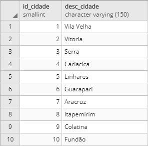
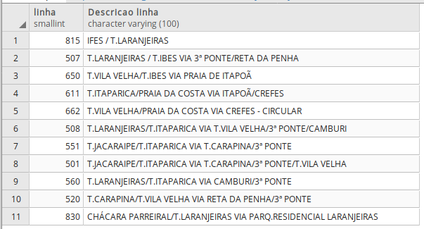
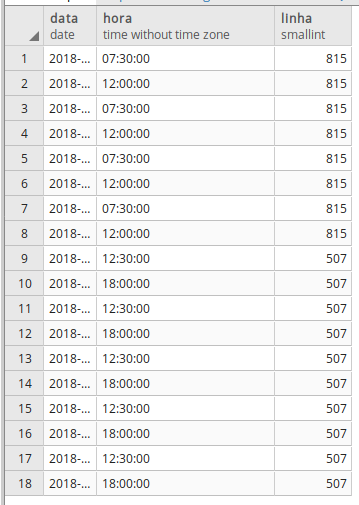
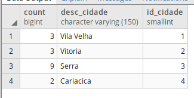
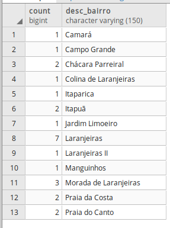
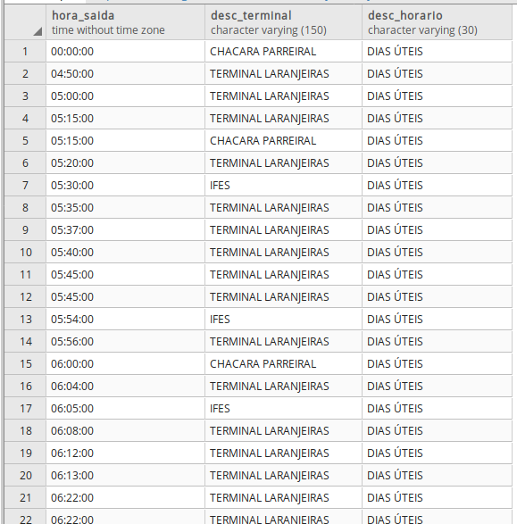

# TRABALHO 01:  QR-Bus
Trabalho desenvolvido durante a disciplina de BD1

# Sumário
- [1.COMPONENTES](#1-componentes) 
- [2.INTRODUÇÃO E MOTIVAÇAO](#2introdução-e-motivaçao) 
- [3.MINI-MUNDO](#3mini-mundo) 
- [4.RASCUNHOS BÁSICOS DA INTERFACE (MOCKUPS)](#4rascunhos-básicos-da-interface-mockups)  
  - [4.1 QUAIS PERGUNTAS PODEM SER RESPONDIDAS COM O SISTEMA PROPOSTO?](#41-quais-perguntas-podem-ser-respondidas-com-o-sistema-proposto)  
  - [4.2 TABELA DE DADOS DO SISTEMA:](#42-tabela-de-dados-do-sistema)  
- [5.MODELO CONCEITUAL](#5modelo-conceitual) 
  - [5.1 Validação do Modelo Conceitual](#51-validação-do-modelo-conceitual) 
  - [5.2 DECISÕES DE PROJETO](#52-decisões-de-projeto) 
  - [5.3 DESCRIÇÃO DOS DADOS](#53-descrição-dos-dados) 
- [6.MODELO LÓGICO](#6modelo-lógico) 
- [7.MODELO FÍSICO](#7modelo-físico) 
- [8.INSERT APLICADO NAS TABELAS DO BANCO DE DADOS](#8insert-aplicado-nas-tabelas-do-banco-de-dados) 
  - [8.1 DETALHAMENTO DAS INFORMAÇÕES](#81-detalhamento-das-informações) 
  - [8.2 INCLUSÃO DO SCRIPT PARA CRIAÇÃO DE TABELAS E INSERÇÃO DOS DADOS](#82-inclusão-do-script-para-criação-de-tabelas-e-inserção-dos-dados) 
  - [8.3 INCLUSÃO DO SCRIPT PARA EXCLUSÃO DE TABELAS EXISTENTES, CRIAÇÃO DE TABELA NOVAS E INSERÇÃO DOS DADOS](#83-inclusão-do-script-para-exclusão-de-tabelas-existentes-criação-de-tabela-novas-e-inserção-dos-dados) 
- [9.TABELAS E PRINCIPAIS CONSULTAS](#9tabelas-e-principais-consultas) 
  - [9.1 CONSULTAS DAS TABELAS COM TODOS OS DADOS INSERIDOS](#91consultas-das-tabelas-com-todos-os-dados-inseridos-todas-) 
  - [9.2 CONSULTAS DAS TABELAS COM FILTROS WHERE](#92consultas-das-tabelas-com-filtros-where-mínimo-4) 
  - [9.3 CONSULTAS QUE USAM OPERADORES LÓGICOS, ARITMÉTICOS E TABELAS OU CAMPOS RENOMEADOS ](#93consultas-que-usam-operadores-lógicos-aritméticos-e-tabelas-ou-campos-renomeados-mínimo-11) 
  - [9.4 CONSULTAS QUE USAM OPERADORES LIKE E DATAS](#94consultas-que-usam-operadores-like-e-datas-mínimo-12-) 
  - [9.5 ATUALIZAÇÃO E EXCLUSÃO DE DADOS](#95atualização-e-exclusão-de-dados-mínimo-6) 
  - [9.6 CONSULTAS COM JUNÇÃO E ORDENAÇÃO](#96consultas-com-junção-e-ordenação-mínimo-6) 
  - [9.7 CONSULTAS COM GROUP BY E FUNÇÕES DE AGRUPAMENTO](#97consultas-com-group-by-e-funções-de-agrupamento-mínimo-6) 
  - [9.8 CONSULTAS COM LEFT E RIGHT JOIN ](#98consultas-com-left-e-right-join-mínimo-4) 
  - [9.9 CONSULTAS COM SELF JOIN E VIEW](#99consultas-com-self-join-e-view-mínimo-6) 
  - [9.10 SUBCONSULTAS](#910subconsultas-mínimo-3) 
- [10.ATUALIZAÇÃO DA DOCUMENTAÇÃO DOS SLIDES PARA APRESENTAÇAO FINAL](#10atualização-da-documentação-dos-slides-para-apresentaçao-final-mínimo-6-e-máximo-10) 
- [11.BACKUP COMPLETO DO BANCO DE DADOS POSTGRES](#11-backup-completo-do-banco-de-dados-postgres) 
- [12.TUTORIAL COMPLETO DE PASSOS PARA RESTAURACAO DO BANCO E EXECUCAO DE PROCEDIMENTOS ENVOLVIDOS NO TRABALHO PARA OBTENÇÃO DOS RESULTADOS](#12tutorial-completo-de-passos-para-restauracao-do-banco-e-execucao-de-procedimentos-envolvidos-no-trabalho-para-obtenção-dos-resultados) 
- [13.DIFICULDADES ENCONTRADAS PELO GRUPO](#13---dificuldades-encontradas-pelo-grupo) 
- [14.FORMATACAO NO GIT](#14--formatacao-no-git-httpshelpgithubcomarticlesbasic-writing-and-formatting-syntax) 
- [OBSERVAÇÕES IMPORTANTES](#observações-importantes) 

### 1. COMPONENTES 
Integrantes do grupo:  
Ewerson Vieira Nascimento: ewersonv@gmail.com 
Giuliano de Paulo Demoner: giuliano.demoner@gmail.com 
Lorran Gabriel Araújo: lorrangabriel20@gmail.com 
Marcos Antônio Carneiro de Paula: cardepaula@gmail.com 

### 2.INTRODUÇÃO E MOTIVAÇÃO 
A bilhetagem eletrônica já é uma realidade nos transportes públicos do nosso estado a algum tempo, diversas pessoas fazem uso do seu cartão para se movimentar durante o dia-a-dia, seja de uso particular ou vinculado ao trabalho. Podemos dizer que a solução existente dá conta do recado e atende bem ao seu propósito, mas somente isso. Ainda temos que enfrentar diversos problemas com o uso do cartão como meio de pagamento, como a recarga em que temos que enfrentar uma fila enorme, taxas por perda ou quebra do cartão, complicado monitoramento de saldo e falta de segurança devido as fraudes. 

A partir dessa visão começamos a buscar por alternativas que poderiam atuar como meio de pagamento das passagens, sendo acessível, seguro e fácil de utilizar. A resposta estava bem na nossa frente, nossos smartphones. 

Através de tecnologias presentes nesses dispositivos seria possível efetuar o pagamento da mesma forma que já conhecemos, apenas o aproximando do leitor, ou até mesmo com um qrcode gerado e lido por câmeras já presentes nos coletivos, mas que tem como finalidade a identificação de fraudes por comparação facial. Além das funções de pagamento de um cartão comum, esse novo método traria os benefícios da internet, facilitando a recarga de nossas passagens através de cartões de credito ou boletos bancários. Como essas funções teriam que ser controlados por meio de um software, ainda poderíamos ter um controle de nossos gastos, com históricos de transações, linhas utilizadas e muito mais. 
 

### 3.MINI-MUNDO 

O sistema proposto conterá as informacões aqui detalhadas. Dos usuários serão armazenados o nome completo, data de nascimento, cpf, endereço, e-mail e senha, sendo esse dois ultimos para efetuar login no sistema. O saldo será informado de acordo com o valor referente ao saldo do usuário no próprio sistema da GVBus, sendo atualizado em tempo real a cada nova operação de recarga ou pagamento realizada. Só poderá existir um único cadastro para cada CPF. Dos meios de pagamento, serão armazenados dados de cartões de credito salvos, contendo o número do cartão, nome do titular e data de validade. Os dados armazenados pertinentes ao cartão de credito deverão seguir as regras do PCI Security Standards Council visando a confiabilidade do sistema. Um usuário pode ter mais de um cartão de crédito. O histórico de uso do aplicativo também deve ter seus dados armazenados, que são as linhas usadas, junto com a data, horário e valor debitado da conta. Os dados dos horários de onibus serão obitidos por API, que devem possuir número da linha, descrição e os horários semanais e diários de origem e destino. O itinerário também será obtido por API, com linha, sentido da linha, ponto de origem, pontos de passagem e ponto de destino da linha. O saldo do usuário deve ser sincronizado com a empresa responsável pelo seu uso (companhia de transporte). 

### 4.RASCUNHOS BÁSICOS DA INTERFACE (MOCKUPS) 
[Mockup feito com Balsamiq](/arquivos/Mockup.pdf)
#### 4.1 QUAIS PERGUNTAS PODEM SER RESPONDIDAS COM O SISTEMA PROPOSTO?
   <b>A Empresa QR-Bus precisa inicialmente dos seguintes relatórios:</b>
* Relatório que informe ao usuário seu histórico de viagens, com dias e horários em que usou o sistema, assim como as linhas utilizadas.
* Relatório que informe as linhas mais utilizadas e as menos utilizadas (por todos os usuários) dependendo do horário.
* Lista direcionada ao usuário informando as melhores opções de linhas para sair de sua origem à seu destino.
* Relatório que informe à gerência bairros ou pontos de ônibus onde há maior concentração de passageiros que efetuam o embarque e o desembarque dos coletivos.
* Relatório de tempo médio de viagem de cada linha do ponto de partida ao ponto de chegada (definidos pelo usuário).
* Relatório direcionado ao usuário para controle de seu saldo, com quantidade de viagens feitas por dia/semana/mês, valor de cada viagem e gasto total no período definido.
 
#### 4.2 TABELA DE DADOS DO SISTEMA:
[Tabela de dados QR-Bus](https://github.com/qr-bus/trab01/tree/master/arquivos/Tabelao_qr-bus.xlsx?raw=true "Tabela - Empresa QR-Bus")
    
>## Marco de Entrega 01 em: (06/09/2018) 

### 5.MODELO CONCEITUAL 
 

     
        
    
#### 5.1 Validação do Modelo Conceitual
   <b>[Grupo01]:</b> Psicultura Inteligente (André Altivo, Gabriela Piffer, Lucca Machado e Marcelo Mendes)
    <b>[Grupo02]:</b> Carga Pesada (Leonardo Sena, Matheus Aguiar, Wallace de Paula e Willian Vaneli)

#### 5.2 DECISÕES DE PROJETO
   <b>Tipo_Horario:</b> Essa tabela foi criada com o intuito de identificar qual o tipo de horario será seguido por aquela linha, dias úteis, feriados, atípicos entre feriados ou fins de semana. 
   
   <b>Cartão:</b> A tabela cartão possui relação (0,n) com usuário, pois decidimos que o usuário pode ou não ter um cartão de crédito para usar o app. 
   
>## Marco de Entrega 02 em: (17/09/2018) 
#### 5.3 DESCRIÇÃO DOS DADOS 
   <b>USUARIO:</b> Tabela que armazena informações relacionadas ao usuário do sistema. 
   - id_usuario: id do usuário, gerado automaticamente. 
   - cpf: cpf do usuário. 
   - nome: nome completo do usuário. 
   - nascimento: data de nascimento do usuário. 
   - email: email do usuário. 
   - senha: senha do usuário. 
   - saldo: saldo do usuário para pagamento de passagens. 
   
   <b>CARTAO:</b> Tabela que contém dados do cartão de passagem do usuário. 
   - numero: número do cartão do usuário. 
   - titular: nome do titular do cartão. 
   - validade: data de validade presente no cartão. 
  
   <b>PASSAGEM:</b> Tabela que armazena os pagamentos de passagens em datas e horarios específicos. 
   - id_passagem: id da passagem, gerado automaticamente. 
   - numero_linha: linha utilizada pelo usuário. 
   - data: data em que o usuário pagou a passagem. 
   - horario: horário em que a passagem foi paga. 
   - valor: valor da passagem paga. 
   
   <b>LINHA:</b> Contém informações sobre a linha do ônibus. 
   - numero_linha: número da linha. 
   - desc_linha: descrição (nome) da linha. 
   
   <b>HORÁRIO:</b> Contém dados sobre horarios das linhas. 
   - id_horario: id da linha, gerado automaticamente. 
   - hora_saida: horário em que o ônibus sai do terminal. 
   - desc_terminal: nome do terminal que o ônibus sairá. 
   - data_inicio: data em que este horário começou a ser utilizado. 
   
   <b>TIPO_HORARIO:</b> Tabela que armazena os tipos de horário. 
   - id_tipo: id do tipo de horário, gerado automaticamente. 
   - desc_horario: descrição do tipo (dias úteis, feriados, atípicos entre feriados ou fins de semana). 
   
   <b>ITINERARIO:</b> Armazena informações sobre o sentido da linha (ida ou volta). 
   - id_itinerario: id do itinerário atrelado a cada rua que a linha percorrerá, gerado automaticamente. 
   - sentido: informa o sentido que a linha percorrerá (ida ou volta). 
   - sequencia: cada rua pela qual o ônibus passará. 
   
   <b>ITINERARIO_PONTO</b> Faz o intermédio entre a entidade Intenario e a Ponto. 
   - id_intin_ponto: id do itinerario_ponto. 
   - pos_sequencia: posiçao na sequencia de pontos que o itinerário possui. 
   
   <b>PONTO:</b> Armazena as coordenas do ponto. 
   - id_ponto: id do ponto, gerado automaticamente. 
   - latitude: latitude para posição geográfica do ponto. 
   - longitude: longitude para posição geográfica do ponto. 
   
   <b>LOGRADOURO:</b> Armazena informações sobre o logradouro (CEP, tipo e nome). 
   - id_logradouro: id do logradouro, gerado automaticamente. 
   - cep: número CEP. 
   - desc_tipo: descrição do tipo de logradouro (rua, avenida, travessa...). 
   - desc_logradouro: nome do logradouro. 
   
   <b>BAIRRO:</b> Armazena informações sobre o bairro (nome e ID). 
   - id_bairro: id do bairro, gerado automaticamente. 
   - desc_bairro: nome do bairro. 
   
   <b>CIDADE:</b> Armazena informações sobre a cidade (nome e ID). 
   - id_cidade: id da cidade, gerado automaticamente. 
   - desc_cidade: nome da cidade. 

### 6	MODELO LÓGICO 
    

### 7	MODELO FÍSICO 
   [Modelo Fisico](arquivos/QR-Bus_-_modelo_fisico.sql)         
        
### 8	INSERT APLICADO NAS TABELAS DO BANCO DE DADOS 
#### 8.1 DETALHAMENTO DAS INFORMAÇÕES 
   [Inserção dos dados](sql/insert.sql)

#### 8.2 INCLUSÃO DO SCRIPT PARA CRIAÇÃO DE TABELAS E INSERÇÃO DOS DADOS
   [Create + Inserts](sql/create_e_insert.sql)
   
#### 8.3 INCLUSÃO DO SCRIPT PARA EXCLUSÃO DE TABELAS EXISTENTES, CRIAÇÃO DE TABELA NOVAS E INSERÇÃO DOS DADOS
   [Drop + Create + Inserts](sql/drop_create_insert.sql)
>## Marco de Entrega 03 em: (27/09/18)  

### 9	TABELAS E PRINCIPAIS CONSULTAS 
    OBS: Incluir para cada tópico as instruções SQL + imagens (print da tela) mostrando os resultados.
#### 9.1	CONSULTAS DAS TABELAS COM TODOS OS DADOS INSERIDOS (Todas)  

	SELECT * FROM BAIRRO;

	SELECT * FROM CARTAO;

	SELECT * FROM CIDADE;

	SELECT * FROM HORARIO;

	SELECT * FROM ITINERARIO;

	SELECT * FROM ITINERARIO_PONTO;

	SELECT * FROM LINHA;

	SELECT * FROM LOGRADOURO;

	SELECT * FROM PAGAMENTO;

	SELECT * FROM PASSAGEM;

	SELECT * FROM PONTO;

	SELECT * FROM TIPO_HORARIO;

	SELECT * FROM USUARIO;

#### 9.2	CONSULTAS DAS TABELAS COM FILTROS WHERE (Mínimo 4) 

	SELECT * FROM logradouro WHERE desc_tipo = 'Avenida';
   
   
	SELECT * FROM itinerario WHERE destino = 'T.JACARAIPE';
   
   
   	SELECT * FROM horario WHERE hora_saida > '07:00:00' AND hora_saida < '07:50:00';
   
   
   	SELECT * FROM logradouro WHERE desc_tipo = 'Rua';
   

#### 9.3	CONSULTAS QUE USAM OPERADORES LÓGICOS, ARITMÉTICOS E TABELAS OU CAMPOS RENOMEADOS (Mínimo 11)
   <b>a) Criar 5 consultas que envolvam os operadores lógicos AND, OR e Not </b> 
    
	SELECT * FROM logradouro 
	WHERE desc_logradouro = 'Rio Branco' 
	OR id_bairro = '2';

	SELECT hora_saida, 
	id_itinerario 
	FROM HORARIO 
	WHERE (hora_saida > '09:09:00' AND id_itinerario = 1);

	SELECT hora_saida, 
	id_itinerario 
	FROM HORARIO WHERE ((hora_saida > '09:09:00')
	AND (id_itinerario = 1 OR  id_itinerario = 3));

	SELECT (desc_tipo|| '. '||desc_logradouro) 
	FROM LOGRADOURO 
	WHERE ((id_bairro = 4) 
	OR (id_bairro = 7));

	SELECT hora_saida, id_itinerario 
	FROM HORARIO 
	WHERE ((hora_saida > '09:09:00') 
	AND (NOT id_itinerario = 3 
	AND NOT id_itinerario = 4));
  
   
   
   
   <b>b) Criar no mínimo 3 consultas com operadores aritméticos </b> 
    
	SELECT numero_cartao,
	valor_pagamento,
	(valor_pagamento - 3.40) AS sobra
	FROM PAGAMENTO 
	WHERE (id_pagamento > 5 );
  

	SELECT cartao.titular ,
	valor_pagamento,
	(valor_pagamento + 90.00) AS sobra 
	FROM PAGAMENTO
	INNER JOIN CARTAO
	ON (cartao.numero = '1111222233339999' 
	OR cartao.numero = '1111222233338888')
	GROUP BY titular,valor_pagamento;
  

	SELECT cartao.titular ,
	valor_pagamento,
	CAST((valor_pagamento / 3.40) AS DECIMAL(3,0)) AS numero_passagens
	FROM PAGAMENTO 
	INNER JOIN CARTAO 
	ON (cartao.numero = '1111222233333333' 
	OR cartao.numero = '1111222233338888' 
	OR cartao.numero = '1111222233335555') 
	GROUP BY titular,valor_pagamento;
  
   
   <b>c) Criar no mínimo 3 consultas com operação de renomear nomes de campos ou tabelas </b> 
   
   <b> 1 </b> 
   
	ALTER TABLE CIDADE RENAME TO MUNICIPIO;
	SELECT * FROM MUNICIPIO;
 

   <b> 2 </b> 
   <b> Antes </b> 
   
	SELECT * FROM linha;
 
   <b> DEPOIS </b> 
   
	ALTER TABLE LINHA RENAME COLUMN desc_linha TO descricao_linha;
 

   <b> 3 </b> 
   <b> Antes </b> 
   
	SELECT * FROM MUNICIPIO;
 
   <b> DEPOIS </b> 
   
	ALTER TABLE MUNICIPIO RENAME COLUMN desc_cidade TO nome_municipio;
	ALTER TABLE MUNICIPIO RENAME COLUMN id_cidade TO id_municipio;
 
      
#### 9.4	CONSULTAS QUE USAM OPERADORES LIKE E DATAS (Mínimo 12)  
   <b>a) Criar outras 5 consultas que envolvam like ou ilike </b> 
    
	SELECT numero_linha 
	FROM LINHA 
	WHERE descricao_linha LIKE 'T.LARANJEIRAS%' 
	OR descricao_linha LIKE '%T.ITAPARICA VIA T.CARAPINA%';
 

	SELECT titular,validade 
	FROM CARTAO
	WHERE((numero = '1111222233332222' ) 
	OR (validade LIKE '%2022'));
 

	SELECT titular,validade 
	FROM CARTAO
	WHERE((numero = '1111222233338888' ) 
	OR (titular LIKE '%Fernandes') 
	OR (titular LIKE 'A%'));
 

	SELECT desc_bairro 
	FROM BAIRRO 
	WHERE ((id_cidade = 2) 
	AND ( desc_bairro ILIKE 'jardim%'));
 

	SELECT nome, nascimento 
	FROM USUARIO 
	WHERE nome ILIKE 'J%' 
	OR nome ILIKE 'A%' 
	ORDER BY nascimento DESC;
  
    
   <b>b) Criar uma consulta para cada tipo de função data apresentada. </b> 

	SELECT id_itinerario, 
	age(current_date, horario.data_inicio) AS "Tempo sem modificar o horario"
	FROM HORARIO
	GROUP BY id_itinerario, age(current_date, horario.data_inicio);
  

	SELECT id_itinerario,
	current_time(0) AS "hora atual",
	hora_saida AS "próximos horarios"
	FROM HORARIO
	WHERE id_itinerario = 4
	AND hora_saida > current_time(0);
  

	SELECT nome,
	nascimento,
	date_part('year', age(now(), nascimento)) AS idade
	FROM USUARIO;
  

	SELECT usuario.nome,
	extract('month' FROM pagamento.data_pagamento) AS "Meses de compra passagem"
	FROM PAGAMENTO
	INNER JOIN CARTAO
	ON (cartao.numero = pagamento.numero_cartao)
	INNER JOIN USUARIO
	ON (usuario.numero_cartao = cartao.numero);
  

#### 9.5	ATUALIZAÇÃO E EXCLUSÃO DE DADOS (Mínimo 6) 
   
   <b> 1 </b> 
   <b> Antes </b> 

	SELECT * FROM PASSAGEM;
 
   <b> DEPOIS </b> 

	UPDATE passagem SET valor = 1.70 
	WHERE hora = '07:30:00';
 

   <b> 2 </b> 
   <b> Antes </b> 
   
	SELECT * FROM CARTAO;
 
   <b> DEPOIS </b> 
   
	UPDATE CARTAO SET titular = 'Joao da Silva Junior' 
	WHERE titular = 'Joao da Silva';
 

<b> 3 </b> 
<b> Antes </b> 

	SELECT * FROM PAGAMENTO;
 
   <b> DEPOIS </b> 
   
	UPDATE PAGAMENTO SET valor_pagamento = 150.00 
	WHERE data_pagamento = '2018-02-08' 
	OR data_pagamento = '2018-06-08';
 

   <b> 4 </b> 
   <b> Antes </b> 
   
	SELECT * FROM passagem;
 
   <b> DEPOIS </b> 

	DELETE FROM PASSAGEM 
	WHERE data = '2018-10-09';
 

   <b> 5 </b> 
   <b> Antes </b> 
   
	SELECT * FROM PAGAMENTO;
 
   <b> DEPOIS </b> 
   
	DELETE FROM PAGAMENTO 
	WHERE id_pagamento = 7;
 

   <b> 6 </b> 
   <b> Antes </b> 
   
	SELECT * FROM ITINERARIO;
 
   <b> DEPOIS </b> 
   
	DELETE FROM ITINERARIO 
	WHERE numero_linha = 611;
 

>## Marco de Entrega 04 em: (18/10/2017) 

#### 9.6	CONSULTAS COM JUNÇÃO E ORDENAÇÃO (Mínimo 6) 
   <b>a) Uma junção que envolva todas as tabelas possuindo no mínimo 3 registros no resultado </b> 

   <b>JOIN COM TODAS AS TABELAS</b> 

	SELECT usuario.nome,
	cartao.numero AS "Cartao de credito",
	pagamento.data_pagamento AS "Data recarga", 
	passagem.data AS "Data da passagem",
	passagem.hora AS "Horario da passagem",
	linha.descricao_linha AS "Linha",
	horario.hora_saida,
	tipo_horario.desc_horario AS "Tipo de horario",
	itinerario.destino AS "Destino do onibus",
	itinerario_ponto.pos_sequencia,
	ponto.id_ponto,
	logradouro.desc_tipo AS "Itinerario - Tipo logradouro",
	logradouro.desc_logradouro AS "Itinerario - Nome logradouro",
	bairro.desc_bairro AS "Itinerario - Bairro", 
	municipio.nome_municipio AS "Itinerario - Cidade"
	FROM USUARIO
	INNER JOIN CARTAO
	ON (usuario.numero_cartao = cartao.numero)
	INNER JOIN PAGAMENTO 
	ON (cartao.numero = pagamento.numero_cartao)
	INNER JOIN PASSAGEM
	ON (passagem.id_usuario = usuario.id_usuario)
	INNER JOIN LINHA
	ON (passagem.numero_linha = linha.numero_linha)
	INNER JOIN ITINERARIO
	ON (itinerario.numero_linha = linha.numero_linha)
	INNER JOIN ITINERARIO_PONTO
	ON (itinerario.id_itinerario = itinerario_ponto.id_itinerario)
	INNER JOIN HORARIO
	ON (itinerario.id_itinerario = horario.id_itinerario)
	INNER JOIN TIPO_HORARIO
	ON (horario.id_tipo = tipo_horario.id_tipo)
	INNER JOIN PONTO
	ON (ponto.id_ponto = itinerario_ponto.id_ponto)
	INNER JOIN LOGRADOURO
	ON (ponto.id_logradouro = logradouro.id_logradouro)
	INNER JOIN BAIRRO
	ON (logradouro.id_bairro = bairro.id_bairro)
	INNER JOIN MUNICIPIO
	ON (bairro.id_cidade = municipio.id_municipio)
	WHERE passagem.hora = '12:30:00'
	AND horario.hora_saida = '12:25:00'
	AND ponto.id_ponto = 1;
 

   <b>b) Outras junções que o grupo considere como sendo as de principal importância para o trabalho </b> 
	

	SELECT itinerario.numero_linha as linha,
	itinerario_ponto.pos_sequencia,
	ponto.id_ponto,
	logradouro.desc_tipo,
	logradouro.desc_logradouro
	FROM ITINERARIO
	INNER JOIN ITINERARIO_PONTO
	ON (itinerario.id_itinerario = itinerario_ponto.id_itinerario)
	INNER JOIN PONTO
	ON (itinerario_ponto.id_ponto = ponto.id_ponto)
	INNER JOIN LOGRADOURO
	ON (ponto.id_logradouro = logradouro.id_logradouro)
	ORDER BY itinerario.numero_linha, itinerario_ponto.pos_sequencia;
 

	SELECT linha.numero_linha as linha,
	horario.hora_saida,
	tipo_horario.desc_horario as "tipo horario"
	FROM HORARIO
	INNER JOIN TIPO_HORARIO
	ON(horario.id_tipo = tipo_horario.id_tipo)
	INNER JOIN ITINERARIO
	ON(itinerario.id_itinerario = horario.id_itinerario)
	INNER JOIN LINHA
	ON (itinerario.numero_linha = linha.numero_linha);
 

	SELECT passagem.data,
	passagem.hora,
	linha.numero_linha as "linha"
	FROM PASSAGEM
	INNER JOIN LINHA
	ON(passagem.numero_linha = linha.numero_linha)
	WHERE passagem.id_usuario = 3
	ORDER BY passagem.data, passagem.hora;
 

   

#### 9.7	CONSULTAS COM GROUP BY E FUNÇÕES DE AGRUPAMENTO (Mínimo 6) 
   
	SELECT COUNT(cep),
	desc_tipo 
	FROM logradouro 
	GROUP BY desc_tipo;
 

	SELECT COUNT(id_horario) as qtd_horarios, 
	desc_terminal 
	FROM horario 
	GROUP BY desc_terminal 
	ORDER BY qtd_horarios desc;
 

	SELECT COUNT(id_passagem) as passagem_vendida, 
	data 
	FROM passagem 
	GROUP BY data;
 

	SELECT COUNT(id_itinerario) as "Itinerario com mesmo destino", 
	destino 
	FROM itinerario 
	GROUP BY destino;
 

	SELECT COUNT(id_bairro) as qtd_bairros, 
	id_cidade 
	FROM bairro 
	GROUP BY id_cidade;
 

	SELECT COUNT(id_pagamento) AS qtd_pagamento, 
	valor_pagamento AS valor_pago 
	FROM pagamento 
	GROUP BY valor_pago;
 
   
#### 9.8	CONSULTAS COM LEFT E RIGHT JOIN (Mínimo 4) 
	SELECT COUNT(bairro.id_bairro), 
	municipio.nome_municipio, 
	municipio.id_municipio
	FROM BAIRRO
	LEFT JOIN MUNICIPIO
	ON bairro.id_cidade = municipio.id_municipio
	GROUP BY municipio.id_municipio
	ORDER BY municipio.id_municipio;
 

	SELECT COUNT(logradouro.cep), 
	bairro.desc_bairro
	FROM LOGRADOURO
	LEFT JOIN BAIRRO
	ON logradouro.id_bairro = bairro.id_bairro
	GROUP BY bairro.desc_bairro
	ORDER BY bairro.desc_bairro;
 

	SELECT COUNT(passagem.id_passagem) AS passagens_vendidas, 
	linha.descricao_linha AS linha
	FROM PASSAGEM
	LEFT JOIN LINHA
	ON passagem.numero_linha = linha.numero_linha
	GROUP BY linha.descricao_linha
	ORDER BY passagens_vendidas desc;
 

	SELECT cartao.numero AS cartao, 
	usuario.email AS enviar_email_para
	FROM CARTAO
	LEFT JOIN USUARIO
	ON cartao.numero = usuario.numero_cartao
	GROUP BY cartao.numero, usuario.email;
 
   
#### 9.9	CONSULTAS COM SELF JOIN E VIEW (Mínimo 6) 
   <b>a) Uma junção que envolva Self Join</b> 
        
	SELECT A.numero_linha, 
	B.numero_linha, 
	A.destino
	FROM itinerario A, itinerario B
	WHERE A.numero_linha <> B.numero_linha
	AND A.destino = B.destino
	ORDER BY A.numero_linha
	LIMIT 10;

  <b>b) Outras junções com views que o grupo considere como sendo de relevante importância para o trabalho </b> 
   
	CREATE VIEW valor_total_recebido AS(
	SELECT SUM(valor_pagamento) AS valor_total_recebido 
	FROM pagamento);

	SELECT * FROM valor_total_recebido;

	CREATE VIEW total_ruas_bairros_cidades_pontos AS(
	SELECT COUNT(logradouro.id_logradouro) AS total_ruas,
	COUNT(bairro.id_bairro) AS total_bairros,
	COUNT(municipio.id_municipio) AS total_cidades,
	COUNT(ponto.id_ponto) AS total_pontos
	FROM LOGRADOURO
	RIGHT JOIN BAIRRO
	ON logradouro.id_bairro = bairro.id_bairro
	RIGHT JOIN MUNICIPIO
	ON bairro.id_cidade = municipio.id_municipio
	INNER JOIN PONTO
	ON ponto.id_logradouro = logradouro.id_logradouro);

	SELECT * FROM total_ruas_bairros_cidades_pontos;
 

	CREATE VIEW usuarios_mes_valor AS(
	SELECT usuario.nome,
	CONCAT(SUBSTRING(CAST(passagem.data AS VARCHAR), 1, 4), '/', 
		SUBSTRING(CAST(passagem.data AS VARCHAR), 6, 2)) AS "Mes",
	SUM(passagem.valor) AS "Valor mensal"
	FROM usuario
	INNER JOIN passagem
	ON usuario.id_usuario = passagem.id_usuario
	GROUP BY usuario.nome, "Mes"
	ORDER BY usuario.nome);

	SELECT * FROM usuarios_mes_valor;
 

	CREATE VIEW numero_viagens_mes_usuario AS(
	SELECT usuario.nome,
	CONCAT(SUBSTRING(CAST(passagem.data AS VARCHAR), 1, 4), '/', 
		SUBSTRING(CAST(passagem.data AS VARCHAR), 6, 2)) AS "Mes",
	COUNT(passagem.id_passagem) AS "Numero de viagens"
	FROM usuario
	INNER JOIN passagem
	ON usuario.id_usuario = passagem.id_usuario
	GROUP BY usuario.nome, "Mes"
	ORDER BY usuario.nome);

	SELECT * FROM numero_viagens_mes_usuario;

 

	CREATE VIEW qtd_passagens_vendidas_dia AS(
	SELECT COUNT(a.id_passagem) AS "numero de passagens" , a.data
	FROM passagem A, passagem B
	WHERE A.id_passagem <> B.id_passagem
	AND A.data = B.data
	GROUP BY a.data);

	SELECT * FROM qtd_passagens_vendidas_dia;
 
   
#### 9.10	SUBCONSULTAS (Mínimo 3) 

	SELECT nome, cpf, CONCAT(desc_tipo,' ', desc_logradouro) AS "mora em", saldo
	FROM usuario
	INNER JOIN logradouro
	ON usuario.id_logradouro = logradouro.id_logradouro
	WHERE usuario.id_usuario NOT IN (SELECT id_usuario FROM passagem)
	ORDER BY nome;
 

	SELECT linha.numero_linha, descricao_linha, hora_saida, desc_terminal, desc_horario
	FROM horario
	INNER JOIN itinerario
	ON horario.id_itinerario = itinerario.id_itinerario
	INNER JOIN linha
	ON itinerario.numero_linha = linha.numero_linha
	INNER JOIN tipo_horario
	ON horario.id_tipo = tipo_horario.id_tipo
	WHERE horario.id_tipo IN (SELECT id_tipo FROM tipo_horario WHERE id_tipo = 1)
	ORDER BY numero_linha;
 

	SELECT hora_saida, desc_terminal, desc_horario
	FROM horario
	INNER JOIN tipo_horario
	ON horario.id_tipo = tipo_horario.id_tipo
	WHERE horario.id_tipo IN (SELECT id_tipo FROM tipo_horario WHERE id_tipo <> 3)
	ORDER BY hora_saida;
 

### 10	ATUALIZAÇÃO DA DOCUMENTAÇÃO DOS SLIDES PARA APRESENTAÇAO FINAL (Mínimo 6 e Máximo 10) 

### 11 Backup completo do banco de dados postgres 
    a) deve ser realizado no formato "backup" 
        (Em Dump Options #1 Habilitar opções Don't Save Owner e Privilege)
    b) antes de postar o arquivo no git o mesmo deve ser testado/restaurado por outro grupo de alunos/dupla
    c) informar aqui o grupo de alunos/dupla que realizou o teste.

### 12	TUTORIAL COMPLETO DE PASSOS PARA RESTAURACAO DO BANCO E EXECUCAO DE PROCEDIMENTOS ENVOLVIDOS NO TRABALHO PARA OBTENÇÃO DOS RESULTADOS 
        a) Outros grupos deverão ser capazes de restaurar o banco 
        b) executar todas as consultas presentes no trabalho
        c) executar códigos que tenham sido construídos para o trabalho 
        d) realizar qualquer procedimento executado pelo grupo que desenvolveu o trabalho
        
### 13   DIFICULDADES ENCONTRADAS PELO GRUPO 
   As maiores dificuldades que encontramos foram relacionadas à montagem do modelo conceitual e, eventualmente, o modelo lógico. Ficamos em dúvida em vários momentos sobre a necessidade de algumas tabelas e certos relacionamentos e realizamos mudanças nos dois modelos até a última semana antes da entrega deste trabalho. Além disso, outra tarefa que demandou tempo e rendeu diversas dúvidas foi a elaboração de relatórios, pois no início não sabíamos o que seria gerado apenas por aquilo que desenvolvemos e o que deveria ser entregue em conjunto com uma API ou serviço externo, de terceiros, integrado ao nosso projeto.
>## Marco de Entrega Final em: (08/11/2018) 
        
### 14  FORMATACAO NO GIT: https://help.github.com/articles/basic-writing-and-formatting-syntax/
<comentario no git>
    
##### About Formatting
    https://help.github.com/articles/about-writing-and-formatting-on-github/
    
##### Basic Formatting in Git
    
    https://help.github.com/articles/basic-writing-and-formatting-syntax/#referencing-issues-and-pull-requests
    
    
##### Working with advanced formatting
    https://help.github.com/articles/working-with-advanced-formatting/
#### Mastering Markdown
    https://guides.github.com/features/mastering-markdown/

    

    
### OBSERVAÇÕES IMPORTANTES

#### Todos os arquivos que fazem parte do projeto (Imagens, pdfs, arquivos fonte, etc..), devem estar presentes no GIT. Os arquivos do projeto vigente não devem ser armazenados em quaisquer outras plataformas.
1. Caso existam arquivos com conteúdos sigilosos, comunicar o professor que definirá em conjunto com o grupo a melhor forma de armazenamento do arquivo.

#### Todos os grupos deverão fazer Fork deste repositório e dar permissões administrativas ao usuário do git "profmoisesomena", para acompanhamento do trabalho.

#### Os usuários criados no GIT devem possuir o nome de identificação do aluno (não serão aceitos nomes como Eu123, meuprojeto, pro456, etc). Em caso de dúvida comunicar o professor.

Link para BrModelo: 
http://www.sis4.com/brModelo/download.html
 

Link para curso de GIT 

